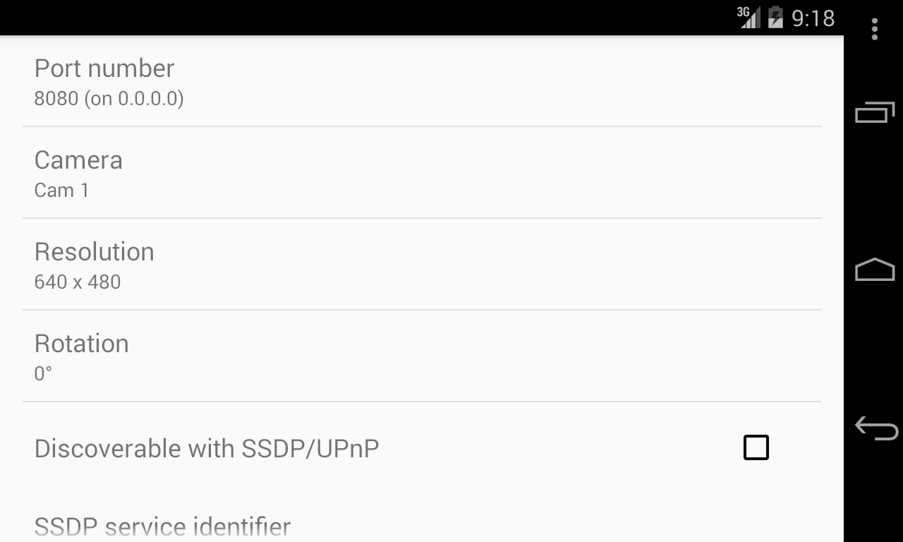

CameraServe
===========

What is it?
-----------

CameraServe is an Android 2.3+ (API level 9) application that allows older (as well as newer)
devices to remain useful by becoming IP cameras.

The app engages the Android device's camera and listens for connections on a
configurable port (default 8080). A web browser or any number of standard IP cam
[monitoring apps](http://www.lavrsen.dk/foswiki/bin/view/Motion/WebHome) can
connect and view the images as an MJPEG (Motion JPEG) stream.

Why was it created?
-------------------

Because many of us have older phones and tablets that are doing nothing more than
gathering dust. So why not put them to good use?

There are other similar apps on the Google Play Store, but they are closed source
and have limitations such as instability, ads, and in-app purchases.

An *explicit* goal of this project is to be open source, freely examinable and
available, and, importantly, side-loadable. When using older devices, especially
unattended, it may not be wise to connect them with your Play Store account.
Side-loading capabilities are therefore required.

What is its status?
-------------------

tl;dr: It's functional. Mostly.

This app was created during a weekend hackathon.
Code quality is, shall we say, rough at best. However, it's slowly being
improved. Features (such as SSDP/UPnP discoverability) are being added. Other
features that should arguably be required, such as authentication, have not yet
been added, and it may be a while before they are. Tests are, regrettably,
nonexistent as well.

Pull requests to address shortcomings as well as to add useful features are
certainly welcome.

What does it look like?
-----------------------

It's mostly a live view of the camera (blank in the emulator screenshot below)
and a configuration screen:

